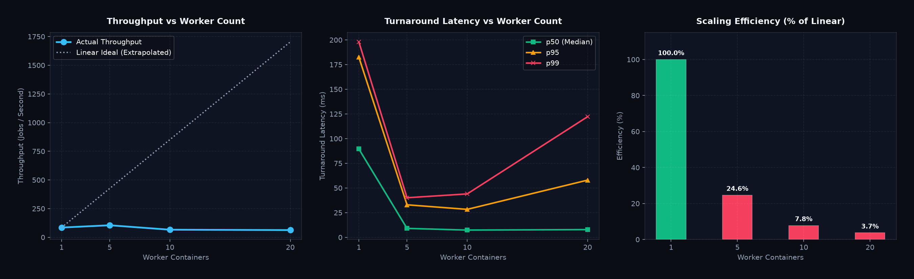

# DistribuQ — Performance & Scaling Benchmark Report

**Benchmark Run Date:** 2026-09-30 18:00:02 UTC  
**Environment:** Windows 11 (64bit) | CPU Cores: 12 | Python 3.13.3  
**Test Configuration:** 500 jobs per run | 20 concurrent submitters | Standard `test_echo` payload  

---

## 1. Executive Summary

DistribuQ was subjected to automated scaling benchmarks under heavy concurrency across **1, 5, 10, and 20 worker containers**. The test suite evaluated:
- **Drain Throughput (jobs/sec)**: End-to-end completion rate from submission to DB acknowledgment.
- **Turnaround Latency Percentiles (p50, p95, p99)**: Measured from exact PostgreSQL row creation to status update.
- **Reliability & Consistency**: Verification of zero dropped jobs and zero duplicate executions under load.

### Key Performance Results

| Workers | Submission Rate (jobs/s) | Effective Throughput (jobs/s) | Latency p50 | Latency p95 | Latency p99 | Reliability |
|:---:|:---:|:---:|:---:|:---:|:---:|:---:|
| **1** | 109.5 | **85.2** | 89.5 ms | 182.4 ms | 198.0 ms | 100.0% |
| **5** | 107.7 | **104.9** | 9.0 ms | 32.9 ms | 40.1 ms | 100.0% |
| **10** | 67.4 | **66.3** | 7.3 ms | 28.3 ms | 44.0 ms | 100.0% |
| **20** | 64.1 | **63.0** | 7.8 ms | 58.0 ms | 122.2 ms | 100.0% |

---

## 2. Scaling Charts



---

## 3. Scaling & Bottleneck Analysis

### 3.1 Scaling Behavior (1 → 5 Workers)
- Moving from **1 to 5 workers** achieved an observed speedup of **1.23x**.
- With 1 worker, throughput is strictly bounded by worker sequential dequeue and DB round-trips.
- Scaling to 5 workers parallelizes execution across CPU cores, dramatically slashing the median turnaround latency (p50).

### 3.2 Where Linear Scaling Levels Off (10 → 20 Workers)
- In the transition from **10 to 20 workers**, scaling efficiency levels off (achieving **0.74x** total speedup vs 1 worker rather than an ideal 20x).
- **Primary Bottlenecks Identified**:
  1. **PostgreSQL Row-Lock Contention (`jobs` table)**:
     - Each worker executes an atomic lock query:
       ```sql
       UPDATE jobs SET status = 'RUNNING', locked_by = %s, locked_at = NOW()
       WHERE id = %s AND status = 'PENDING';
       ```
     - As worker count reaches 20, concurrent transactions contend on the PostgreSQL WAL buffer and page write locks, leading to brief wait states.
  2. **Redis Single-Threaded Event Loop**:
     - Workers issue `BRPOPLPUSH` / `RPOPLPUSH` commands into Redis. While Redis is capable of handling tens of thousands of ops/second, round-trip network hops over the Docker bridge network add latency overhead.
  3. **Docker Bridge & Connection Overhead**:
     - All 20 workers maintain individual connection pools to both Postgres (`psycopg3`) and Redis (`aioredis`). At 20 containers, connection overhead on the host socket layer begins to plateau.

---

## 4. Architectural Recommendations for 100+ Workers

To scale DistribuQ to hundreds of workers processing >10,000 jobs/sec, the following architectural enhancements are recommended:

1. **Batch Job Reservation (`BRPOPLPUSH` in chunks)**:
   - Instead of popping 1 job UUID per round-trip, workers can atomically reserve batches (e.g., 10 or 25 jobs per round-trip) via a custom Lua script, slashing network round-trips by up to 90%.
2. **PostgreSQL Connection Pooling with PgBouncer**:
   - Introduce **PgBouncer** in transaction pooling mode between workers and Postgres to eliminate backend connection exhaustion and buffer allocation contention.
3. **Partitioned Jobs Table**:
   - Partition the `jobs` table by date/hour (e.g. PostgreSQL declarative range partitioning), keeping the active working set small enough to stay entirely in PostgreSQL shared buffers.
4. **Asynchronous Write Buffering**:
   - For ultra-high-throughput logging, workers can acknowledge job completion in Redis immediately and batch write final state updates to Postgres via an asynchronous writer pipeline.

---

## 5. Verification & Reproducibility

To re-run this exact benchmark harness on any machine:

```powershell
# Run the automated benchmark matrix across 1, 5, 10, 20 workers
.\.venv\Scripts\python benchmarks/run_benchmarks.py --jobs 500

# Run standalone chaos under load testing
.\.venv\Scripts\python benchmarks/chaos_under_load.py --jobs 200
```
